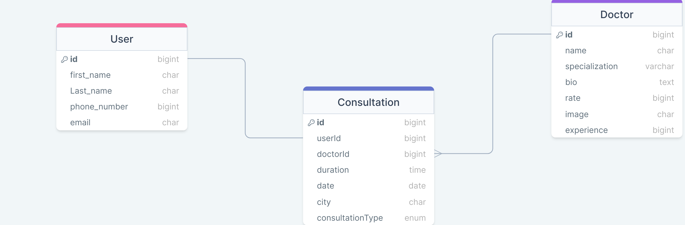

<a name="readme-top"></a>

  <h3>NetCare App</b></h3>

  

</div>

# 📗 Table of Contents

- [📖 About the Project](#about-project)
  - [🛠 Built With](#built-with)
    - [Tech Stack](#tech-stack)
    - [Key Features](#key-features)
  - [💻 Getting Started](#getting-started)
  - [Setup](#setup)
  - [Prerequisites](#prerequisites)
  - [Install](#install)
  - [Usage](#usage)
  - [Run tests](#run-tests)
  - [👥 Authors](#authors)
- [🔭 Future Features](#future-features)
- [🤝 Contributing](#contributing)
- [⭐️ Show your support](#support)
- [🙏 Acknowledgements](#acknowledgements)
- [❓ FAQ (OPTIONAL)](#faq)
- [📝 License](#license)

# 📖 [NetCare App] <a name="The Healthnet App helps you to find doctors and book appointment for various healthcare consultations."></a>


**[NetCare App]** is based on Ruby on Rails base app for that allows petient and doctors to get in touch and schedule consultations.

 [Kanban Board](https://github.com/users/Munyabelden/projects/4/views/1?layout=board)
 
 
 Below is the link to the database diagram


## 🛠 Built With <a name="built-with"></a>

### Tech Stack <a name="tech-stack"></a>

<details>
  <summary>Client</summary>
  <ul>
    <li><a href=#>Ruby on Rails</a></li>
  </ul>
</details>

<details>
  <summary>Server</summary>
  <ul>
    <li><a href=#>Localhost</a></li>
  </ul>
</details>

<details>
<summary>Postgre SQL</summary>
  <ul>
    <li><a href=#>N/A</a></li>
  </ul>
</details>

### Key Features <a name="key-features"></a>

- **[App for Finding Doctors, Booking appointments]**

<p align="right">(<a href="#readme-top">back to top</a>)</p>

## 💻 Getting Started <a name="getting-started"></a>

To get a local copy up and running, follow these steps.

- clone this https://github.com/Munyabelden/Final_Capstone.git


## 💻 Getting Started <a name="getting-started"></a>

To get a local copy up and running, follow these steps.

### Prerequisites

In order to run this project you need:

- [ ] Ruby: [Installation Guide](https://www.ruby-lang.org/en/documentation/installation/)
- [ ] Ruby on Rails: [Installation Guide](https://guides.rubyonrails.org/getting_started.html#installing-rails)
- [ ] PostgreSQL: [Installation Guide](https://www.postgresql.org/docs/)

### Setup

Clone this repository to your desired folder:

```sh
  cd Rails_Capstone
  git clone https://github.com/Munyabelden/Rails_Capstone.git
```

### Install

Install this project with:

```sh
  cd Rails_Capstone
  bundle install
```
```sh
  gem install rspec
```
```sh
  gem install --no-document rubocop -v '>= 1.0, < 2.0' # https://docs.rubocop.org/en/stable/installation/
```
```sh
  npm install --save-dev stylelint@13.x stylelint-scss@3.x stylelint-config-standard@21.x stylelint-csstree-validator@1.x
```

### Usage

To run the project, execute the following command:

```sh
  rails db:create
```
```sh
  rails db:migrate
```
```sh
  rails server
```

### Run tests

To run tests, run the following command:

```sh
  rubocop --color
```
```sh
  npx stylelint "**/*.{css,scss}"
```
```sh
  rspec
```
### Deployment

You can deploy this project using:

- [ ] Use render or any other hosting of your choosing

<p align="right">(<a href="#readme-top">back to top</a>)</p>

<p align="right">(<a href="#readme-top">back to top</a>)</p>

## 👥 Authors <a name="authors"></a>

👤 **Mudasir Issah**

- GitHub: [@mudasiri](https://github.com/mudasiri)
- LinkedIn: [mudasiri](https://linkedin.com/in/mudasiri)


👤 **Belden Mugauri**

- GitHub: [@githubhandle](https://github.com/Munyabelden)
- LinkedIn: [LinkedIn](https://www.linkedin.com/in/munyaradzi-mugauri-828a7b24a/)

👤 **Badare Basem Simon**

- GitHub: [@githubhandle](https://github.com/BB-Simon)
- LinkedIn: [LinkedIn](https://www.linkedin.com/in/BB-Simon/)

👤 **Abel Seifu**

- GitHub: [@githubhandle](https://github.com/Abe1able)
- LinkedIn: [LinkedIn](https://www.linkedin.com/in/Abe1able/)

👤 **Kevin Kaviku**

- GitHub: [@githubhandle](https://github.com/brainskev)
- Twitter: [@twitterhandle](https://twitter.com/brainskev)
- LinkedIn: [LinkedIn](https://www.linkedin.com/in/brainskev/)

<p align="right">(<a href="#readme-top">back to top</a>)</p>

## 🔭 Future Features <a name="future-features"></a>

- [ ] **[Navigation Bar]**
- [ ] **[Online Consultation Integration]**
- [ ] **[E Payments and wallet systems]**


<p align="right">(<a href="#readme-top">back to top</a>)</p>

## 🤝 Contributing <a name="contributing"></a>

Contributions, issues, and feature requests are welcome!

Feel free to check the [repo](https://github.com/Munyabelden/Final_Capstone.git) 

<p align="right">(<a href="#readme-top">back to top</a>)</p>

## ⭐️ Show your support <a name="support"></a>

If you like this project please follow me on github

<p align="right">(<a href="#readme-top">back to top</a>)</p>

## 🙏 Acknowledgments <a name="acknowledgements"></a>

We would like to thank Murat Korkmaz on Behance for the original idea and Microverse.

<p align="right">(<a href="#readme-top">back to top</a>)</p>

## ❓ FAQ (OPTIONAL) <a name="faq"></a>

- **[What is Healthnet App?]**

  - [The Healthnet App helps you to find doctors and book appointment for various healthcare consultations.]


<p align="right">(<a href="#readme-top">back to top</a>)</p>

## 📝 License <a name="license"></a>

This project is [MIT](./LICENSE) licensed.

<p align="right">(<a href="#readme-top">back to top</a>)</p>
